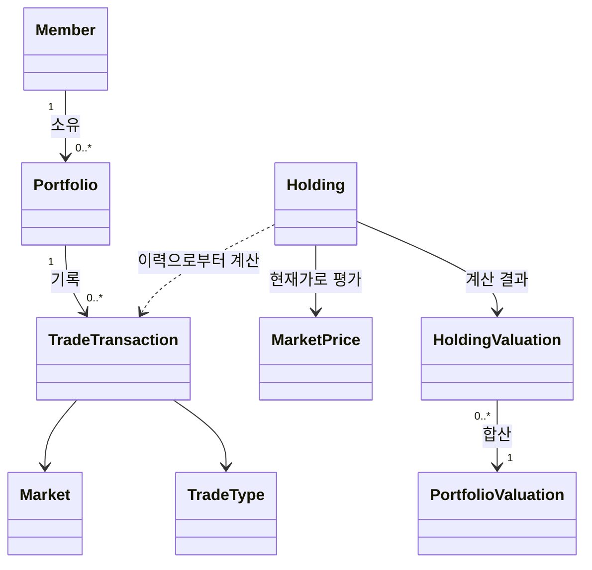

# Trade Guide

미국 주식 포트폴리오의 매매 기록을 관리하고, 현재가와 투자 규칙을 바탕으로 투자 판단을 돕는 웹 서비스입니다.

이 프로젝트는 투자 수익을 보장하거나 자동 매매를 실행하지 않습니다. 사용자가 예약 매수/매도 등 최종 투자 판단을 내릴 수 있도록 근거와 기준을 제공하는 것이 목표입니다.

## 프로젝트 목표

1. 매매 기록과 보유 종목을 바탕으로 포트폴리오 상태를 정확하게 계산한다.
2. 시장 상황, 외부 요인, 검증된 매매 규칙을 반영해 매수·매도·보유 판단의 근거를 제공한다.
3. Java, Spring Boot, REST API, JPA, 테스트, Git을 실제 기능 단위로 학습한다.

현재 MVP는 미국 주식(`Market.US`)을 대상으로 한다. 시장 구분과 시세 제공자 인터페이스를 분리해 두어, 이후 다른 시장과 외부 시세 API로 확장할 수 있다.

## 현재 범위

### 구현 완료

- 회원 생성
  - 이메일과 닉네임 중복 검증
- 회원별 포트폴리오 생성
- 포트폴리오별 매수/매도 기록 등록
  - 회원이 소유한 포트폴리오인지 검증
  - 매도 수량이 보유 수량을 초과하지 않도록 검증
  - 종목 코드를 대문자로 정규화
- 매매 기록을 기반으로 한 보유 종목 조회
  - 보유 수량
  - 평균 매입가
- 종목별 평가 계산 도메인 로직
  - 매입금액, 평가금액, 평가손익, 수익률
- 포트폴리오 전체 평가 계산 도메인 로직
  - 종목별 평가 결과 합산
  - 전체 매입금액, 평가금액, 평가손익, 수익률
- 포트폴리오 평가 조회 API
  - Twelve Data의 현재가 API를 이용해 미국 주식 평가
- 현재가 조회 캐시
  - 종목별 현재가를 1분간 메모리에 보관해 반복 호출을 줄임
- 단위 테스트, Repository 테스트, Controller 테스트
- H2 인메모리 데이터베이스와 H2 Console

### 향후 계획

- 실제 미국 주식 시세 API 연동
- 시장 상태와 뉴스/경제 지표 등 외부 요인 연동
- 검증된 매매 규칙과 전략의 버전 관리
- 과거 데이터 기반 백테스트와 전략 성과 비교
- 사용자 인증 및 권한 관리
- React/TypeScript 기반 웹 화면
- 운영 데이터베이스, 환경 변수와 배포 구성

## 기술 스택

- Java 21
- Spring Boot 3.5.4
- Spring Web
- Spring Validation
- Spring Data JPA / Hibernate
- H2 Database
- JUnit 5 / Mockito / AssertJ
- Gradle 9.3.0

## 도메인 모델



### 원본 데이터

`TradeTransaction`이 매매 기록의 원본 데이터다. `Holding`은 데이터베이스에 저장하지 않고, 매매 기록을 시간순으로 계산해 만든 조회용 값 객체다.

```text
Member -> Portfolio -> TradeTransaction -> Holding -> Valuation
```

이 구조를 선택한 이유는 평균 매입가와 보유 수량을 매번 임의로 갱신하는 대신, 매매 이력을 보존하고 언제든 같은 기준으로 보유 현황을 재계산하기 위해서다.

### 주요 객체

| 객체 | 역할 |
| --- | --- |
| `Member` | 서비스 사용자 |
| `Portfolio` | 사용자가 관리하는 투자 계좌 또는 포트폴리오 |
| `TradeTransaction` | 매수/매도 시점의 변경 불가능한 기록 |
| `Holding` | 거래 이력으로부터 계산된 현재 보유 종목 |
| `MarketPrice` | 특정 시점의 종목 현재가 |
| `HoldingValuation` | 한 종목의 평가 결과 |
| `PortfolioValuation` | 포트폴리오 전체 평가 결과 |

## 계산 규칙

### 보유 종목 계산

- 매수 시: 수량을 더하고, 매수 수수료를 포함해 이동평균 매입가를 다시 계산한다.
- 매도 시: 수량만 차감하고 평균 매입가는 유지한다.
- 전량 매도 시: 해당 종목은 보유 목록에서 제외한다.
- 보유 수량보다 많이 매도하려 하면 예외를 발생시킨다.
- 거래 입력 순서와 관계없이 거래 시각(`tradedAt`) 오름차순으로 계산한다.

### 평가 계산

```text
매입금액 = 평균 매입가 x 보유 수량
평가금액 = 현재가 x 보유 수량
평가손익 = 평가금액 - 매입금액
수익률(%) = 평가손익 x 100 / 매입금액
```

금액과 수량은 `BigDecimal`로 계산한다. 계산 중에는 충분한 소수점 자릿수를 유지하고, API 응답에서 표시 자릿수를 정리한다. 포트폴리오 수익률은 종목별 수익률의 단순 평균이 아니라 전체 매입금액을 기준으로 계산한다.

## 패키지 구조

```text
com.tradeguide
├── controller       # HTTP 요청과 응답
├── domain           # 핵심 비즈니스 객체와 계산 결과
├── dto              # API 요청/응답 객체
├── exception        # 공통 예외 응답 처리
├── repository       # JPA Repository
└── service          # 유스케이스와 계산 로직
    ├── holding
    ├── market
    ├── member
    ├── portfolio
    ├── trade
    └── valuation
```

기본 요청 흐름은 다음과 같다.

```text
Controller -> Service -> Repository -> Database
```

`DTO`는 HTTP 요청과 응답을 표현하고, `Entity`는 데이터베이스 저장 모델을 표현한다. 따라서 Entity를 API 응답으로 직접 노출하지 않는다.

## 구현된 API

| 메서드 | 엔드포인트 | 설명 |
| --- | --- | --- |
| `POST` | `/api/members` | 회원 생성 |
| `POST` | `/api/members/{memberId}/portfolios` | 포트폴리오 생성 |
| `POST` | `/api/members/{memberId}/portfolios/{portfolioId}/transactions` | 매매 기록 등록 |
| `GET` | `/api/members/{memberId}/portfolios/{portfolioId}/holdings` | 보유 종목 조회 |
| `GET` | `/api/members/{memberId}/portfolios/{portfolioId}/valuation` | 현재가 기준 포트폴리오 평가 조회 |

### 회원 생성 예시

```http
POST /api/members
Content-Type: application/json

{
  "email": "beans@example.com",
  "nickname": "beans"
}
```

### 매수 기록 등록 예시

```http
POST /api/members/1/portfolios/1/transactions
Content-Type: application/json

{
  "market": "US",
  "ticker": "AAPL",
  "tradeType": "BUY",
  "quantity": 10,
  "executedPrice": 100.00,
  "fee": 0.10,
  "tradedAt": "2026-08-03T13:30:00Z"
}
```

## 실행 및 테스트

### 요구 사항

- JDK 21

### 애플리케이션 실행

```bash
./gradlew bootRun
```

기본 실행 주소는 `http://localhost:8080`입니다.

### H2 Console

- URL: `http://localhost:8080/h2-console`
- JDBC URL: `jdbc:h2:mem:tradeguide`
- 사용자 이름: `sa`
- 비밀번호: 비움

H2는 현재 인메모리 데이터베이스이므로 애플리케이션을 재시작하면 데이터가 초기화됩니다.

### 테스트 실행

```bash
./gradlew test
```

Gradle 캐시 때문에 변경한 테스트가 실행되지 않은 것처럼 보이면 아래 명령을 사용합니다.

```bash
./gradlew test --rerun-tasks
```

테스트 실행 상태가 일관되지 않으면 생성된 산출물을 정리한 뒤 다시 실행합니다.

```bash
./gradlew clean test
```

## 개발 원칙

- 금액과 수량은 `double`이 아닌 `BigDecimal`로 계산한다.
- 외부 시세는 특정 API 클라이언트가 아닌 `MarketPriceProvider`에 의존한다.
- Twelve Data API 키는 `TWELVE_DATA_API_KEY` 환경 변수 또는 Git에서 제외된 `application-local.yml`로만 제공한다.
- 시장 데이터와 투자 전략은 가이드에 사용하기 전에 버전 관리하고 테스트한다.
- 서비스는 자동 매매나 수익 보장이 아닌 의사결정 지원을 제공한다.
- API 키와 토큰 같은 비밀값은 환경별 설정으로 분리하고 Git에 커밋하지 않는다.

## Git 작업 흐름

작은 기능 브랜치를 사용하고, 동작이 완료된 기능 단위로 커밋한다.

```text
main
feature/portfolio-foundation
```

커밋 메시지 예시:

```text
feat: 포트폴리오 평가 계산 기능 추가
test: 포트폴리오 평가 서비스 테스트 추가
fix: 보유 수량 초과 매도 검증 수정
```
