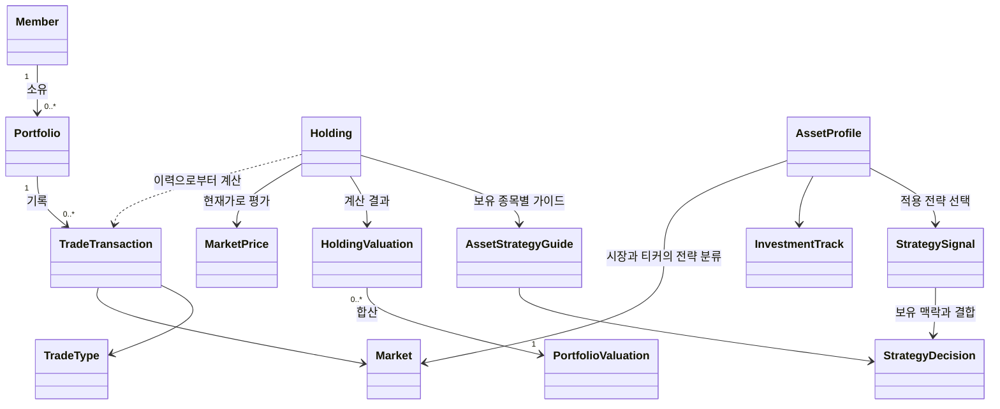

# Trade Guide

미국 주식 포트폴리오의 매매 기록을 관리하고, 현재가와 투자 규칙을 바탕으로 투자 판단을 돕는 웹 서비스입니다.

이 프로젝트는 투자 수익을 보장하거나 자동 매매를 실행하지 않습니다. 사용자가 예약 매수/매도 등 최종 투자 판단을 내릴 수 있도록 근거와 기준을 제공하는 것이 목표입니다.

## 프로젝트 목표

1. 매매 기록과 보유 종목을 바탕으로 포트폴리오 상태를 정확하게 계산한다.
2. 시장 상황, 외부 요인, 검증된 매매 규칙을 반영해 매수·매도·보유 판단의 근거를 제공한다.
3. Java, Spring Boot, REST API, JPA, 테스트, Git을 실제 기능 단위로 학습한다.

현재 MVP는 미국 주식(`Market.US`)을 대상으로 한다. 시장 구분과 시세 제공자 인터페이스를 분리해 두어, 이후 다른 시장과 외부 시세 API로 확장할 수 있다.

## 현재 범위

### 구현 완료

- 회원 생성
  - 이메일과 닉네임 중복 검증
- 회원별 포트폴리오 생성
- 포트폴리오별 매수/매도 기록 등록
  - 회원이 소유한 포트폴리오인지 검증
  - 매도 수량이 보유 수량을 초과하지 않도록 검증
  - 종목 코드를 대문자로 정규화
- 매매 기록을 기반으로 한 보유 종목 조회
  - 보유 수량
  - 평균 매입가
- 종목별 평가 계산 도메인 로직
  - 매입금액, 평가금액, 평가손익, 수익률
- 포트폴리오 전체 평가 계산 도메인 로직
  - 종목별 평가 결과 합산
  - 전체 매입금액, 평가금액, 평가손익, 수익률
- 포트폴리오 평가 조회 API
  - Twelve Data의 현재가 API를 이용해 미국 주식 평가
- 현재가 조회 캐시
  - 종목별 현재가를 1분간 메모리에 보관해 반복 호출을 줄임
- Twelve Data 일봉·주봉 캔들 조회
  - `DAILY`, `WEEKLY` 캔들 구분
  - 주봉 이동평균 계산에 사용할 최근 캔들 데이터 조회
  - 전략 판단용 완료 주봉은 최신 완료 주봉 기준일이 바뀔 때까지 메모리에 보관
- 전략 자산 프로필 관리
  - `market + ticker`를 유니크 키로 하는 `AssetProfile` 저장
  - 티커 대문자 정규화와 중복 등록 `409 Conflict` 처리
  - 관리자용 프로필 등록·목록 조회 API
- Track A 전략 엔진의 첫 구현
  - SOXL 등 명시적으로 등록한 `TRACK_A` 자산 대상
  - 주봉 10/40 이동평균의 현재 추세와 상·하향 교차 이벤트를 함께 반환
  - 종목 단독 가이드는 시장 데이터만 해석한 `StrategySignal`을 반환
  - 포트폴리오 가이드는 보유 여부를 반영해 `StrategySignal`에서 `HOLD` 또는 `SELL` 행동을 결정
  - 판단에는 현재 40주 평균과 직전 40주 평균 비교를 위해 최소 41개 주봉 필요
- 종목·포트폴리오 전략 가이드 조회
  - 종목별 시장 신호: 추세, 교차 이벤트, 교차 후 경과 주, 기준 가격, 근거 반환
  - 보유 종목과 등록된 `TRACK_A` 후보를 각각 조회
  - 다종목 조회는 성공한 가이드와 시장 데이터를 조회하지 못한 종목을 함께 반환
- 포트폴리오 보유 종목 노출 비중 조회
  - 현재 평가금액과 포트폴리오 전체 평가금액 대비 비중 반환
- 단위 테스트, Repository 테스트, Controller 테스트
- H2 인메모리 데이터베이스와 H2 Console

### 향후 계획

- 시장 상태와 뉴스/경제 지표 등 외부 요인 연동
- `TradePlan` 기반의 주문 초안
  - 주문 수량 또는 비율, 지정가, 손절 발동가, 유효 기간
  - 전략 판단과 주문 초안의 분리
- 검증된 매매 규칙의 설정·버전 관리와 활성화 승인
- 과거 데이터 기반 백테스트와 전략 성과 비교
- 사용자 인증 및 권한 관리
- React/TypeScript 기반 웹 화면
- PostgreSQL 운영 데이터베이스와 Flyway 스키마 마이그레이션

## 기술 스택

- Java 21
- Spring Boot 3.5.4
- Spring Web
- Spring Validation
- Spring Data JPA / Hibernate
- H2 Database
- PostgreSQL / Flyway
- JUnit 5 / Mockito / AssertJ
- Gradle 9.3.0

## 멀티 PC 학습 환경

이 프로젝트는 회사 MacBook과 집 Windows PC에서 각각 로컬로 실행하고, GitHub 원격 저장소를 기준으로 소스를 동기화한다. IntelliJ 설정, H2 인메모리 데이터, 실행 중인 애플리케이션, 환경 변수는 각 PC에서 독립적으로 관리한다.

작업을 마칠 때는 테스트 후 변경 사항을 커밋하고 원격 저장소에 푸시한다.

```bash
git status
./gradlew test
git add .
git commit -m "변경 내용"
git push
```

다른 PC에서 작업을 시작할 때는 현재 브랜치를 확인한 뒤 원격 변경 사항을 먼저 반영한다.

```bash
git status
git switch main
git pull --ff-only
git switch feature/candidate-entry-window
git pull --ff-only
./gradlew test
```

`application-local.yml`, `.env`, API Key와 같은 비밀값은 GitHub에 올리지 않는다. 각 PC에서 별도로 설정한다. 진행 상황과 다음 학습 단계는 [학습 로그](docs/LEARNING_LOG.md)에 기록한다.

## PostgreSQL 로컬 실행

기본 프로필은 계속 `local`이며, H2 인메모리 DB와 Hibernate `create`를 사용한다. 따라서 기존 학습·테스트 흐름은 평소처럼 `./gradlew test` 또는 `./gradlew bootRun`으로 실행한다.

PostgreSQL 확인이 필요할 때만 아래처럼 실행한다. Compose의 기본 호스트 포트는 H2 Console이나 다른 PostgreSQL과의 충돌을 줄이기 위해 **5433**이며, 컨테이너 내부 포트는 5432다.

```bash
cp .env.example .env
# .env의 POSTGRES_PASSWORD를 고유한 로컬 값으로 변경
docker compose up -d

# .env 값을 셸 환경 변수로 제공하고 local, postgres 프로필을 함께 실행
# local 프로필은 Twelve Data 설정과 개발용 회원을 제공한다.
set -a
source .env
set +a
./gradlew bootRun --args='--spring.profiles.active=local,postgres'
```

`postgres` 프로필에서는 Flyway가 `V1__create_initial_schema.sql`을 적용하고 Hibernate는 기존 엔티티와 스키마의 일치 여부만 `validate`한다. `local` 프로필이 함께 활성화되면 빈 로컬 DB에는 개발용 회원을 한 번 생성하므로, 프론트의 `VITE_LOCAL_MEMBER_ID=1`로 첫 포트폴리오 생성 화면을 확인할 수 있다. 배포 환경에는 적용되지 않는다. 기동 로그의 `Successfully applied` 메시지와 PostgreSQL의 `flyway_schema_history` 테이블로 적용 여부를 확인할 수 있다. 종료와 데이터 초기화는 각각 `docker compose down`, `docker compose down -v`를 사용한다(뒤 명령은 로컬 PostgreSQL 볼륨을 삭제한다).

## 도메인 모델



### 원본 데이터

`TradeTransaction`이 매매 기록의 원본 데이터다. `Holding`은 데이터베이스에 저장하지 않고, 매매 기록을 시간순으로 계산해 만든 조회용 값 객체다.

```text
Member -> Portfolio -> TradeTransaction -> Holding -> Valuation
```

이 구조를 선택한 이유는 평균 매입가와 보유 수량을 매번 임의로 갱신하는 대신, 매매 이력을 보존하고 언제든 같은 기준으로 보유 현황을 재계산하기 위해서다.

### 주요 객체

| 객체 | 역할 |
| --- | --- |
| `Member` | 서비스 사용자 |
| `Portfolio` | 사용자가 관리하는 투자 계좌 또는 포트폴리오 |
| `TradeTransaction` | 매수/매도 시점의 변경 불가능한 기록 |
| `Holding` | 거래 이력으로부터 계산된 현재 보유 종목 |
| `MarketPrice` | 특정 시점의 종목 현재가 |
| `HoldingValuation` | 한 종목의 평가 결과 |
| `PortfolioValuation` | 포트폴리오 전체 평가 결과 |
| `AssetProfile` | 시장·티커별 투자 트랙을 관리하는 전략 자산 카탈로그 |
| `StrategySignal` | 시장 데이터만으로 계산한 추세, 교차 이벤트, 기준 가격, 근거 |
| `StrategyDecision` | 보유 종목 맥락을 반영한 최종 행동과 근거 |
| `AssetStrategyGuide` | 보유 종목과 해당 종목의 전략 판단을 묶은 값 객체 |

## 계산 규칙

### 보유 종목 계산

- 매수 시: 수량을 더하고, 매수 수수료를 포함해 이동평균 매입가를 다시 계산한다.
- 매도 시: 수량만 차감하고 평균 매입가는 유지한다.
- 전량 매도 시: 해당 종목은 보유 목록에서 제외한다.
- 보유 수량보다 많이 매도하려 하면 예외를 발생시킨다.
- 거래 입력 순서와 관계없이 거래 시각(`tradedAt`) 오름차순으로 계산한다.

### 평가 계산

```text
매입금액 = 평균 매입가 x 보유 수량
평가금액 = 현재가 x 보유 수량
평가손익 = 평가금액 - 매입금액
수익률(%) = 평가손익 x 100 / 매입금액
```

금액과 수량은 `BigDecimal`로 계산한다. 계산 중에는 충분한 소수점 자릿수를 유지하고, API 응답에서 표시 자릿수를 정리한다. 포트폴리오 수익률은 종목별 수익률의 단순 평균이 아니라 전체 매입금액을 기준으로 계산한다.

## 패키지 구조

```text
com.tradeguide
├── controller       # HTTP 요청과 응답
├── domain           # 핵심 비즈니스 객체와 계산 결과
├── dto              # API 요청/응답 객체
├── exception        # 공통 예외 응답 처리
├── repository       # JPA Repository
└── service          # 유스케이스와 계산 로직
    ├── holding
    ├── market
    ├── member
    ├── portfolio
    ├── strategy
    │   └── tracka
    ├── trade
    └── valuation
```

기본 요청 흐름은 다음과 같다.

```text
Controller -> Service -> Repository -> Database
```

`DTO`는 HTTP 요청과 응답을 표현하고, `Entity`는 데이터베이스 저장 모델을 표현한다. 따라서 Entity를 API 응답으로 직접 노출하지 않는다.

## 구현된 API

| 메서드 | 엔드포인트 | 설명 |
| --- | --- | --- |
| `POST` | `/api/members` | 회원 생성 |
| `POST` | `/api/members/{memberId}/portfolios` | 포트폴리오 생성 |
| `POST` | `/api/members/{memberId}/portfolios/{portfolioId}/transactions` | 매매 기록 등록 |
| `GET` | `/api/members/{memberId}/portfolios/{portfolioId}/holdings` | 보유 종목 조회 |
| `GET` | `/api/members/{memberId}/portfolios/{portfolioId}/valuation` | 현재가 기준 포트폴리오 평가 조회 |
| `GET` | `/api/members/{memberId}/portfolios/{portfolioId}/strategy-guides` | 보유 종목별 전략 가이드와 조회 불가 종목 목록 조회 |
| `GET` | `/api/members/{memberId}/portfolios/{portfolioId}/candidate-strategy-guides` | 등록된 `TRACK_A` 중 포트폴리오 미보유 후보 가이드와 조회 불가 종목 목록 조회 |
| `GET` | `/api/members/{memberId}/portfolios/{portfolioId}/exposures` | 보유 종목별 현재 평가금액 노출 비중 조회 |
| `GET` | `/api/markets/{market}/stocks/{ticker}/candles/daily` | 일봉 캔들 조회 |
| `GET` | `/api/markets/{market}/stocks/{ticker}/candles/weekly` | 주봉 캔들 조회 |
| `GET` | `/api/markets/{market}/stocks/{ticker}/strategy-guide` | 한 종목의 전략 가이드 조회 |
| `POST` | `/api/admin/asset-profiles` | 전략 자산 프로필 등록 |
| `GET` | `/api/admin/asset-profiles` | 등록된 전략 자산 프로필 목록 조회 |

### 회원 생성 예시

```http
POST /api/members
Content-Type: application/json

{
  "email": "beans@example.com",
  "nickname": "beans"
}
```

### 매수 기록 등록 예시

```http
POST /api/members/1/portfolios/1/transactions
Content-Type: application/json

{
  "market": "US",
  "ticker": "AAPL",
  "tradeType": "BUY",
  "quantity": 10,
  "executedPrice": 100.00,
  "fee": 0.10,
  "tradedAt": "2026-08-03T13:30:00Z"
}
```

### 전략 자산 프로필 등록 예시

현재 `/api/admin/**` 경로는 인증을 구현하기 전의 로컬 개발용 관리 기능이다. 실제 공개 환경에서는 관리자 권한 검증을 적용해야 한다.

```http
POST /api/admin/asset-profiles
Content-Type: application/json

{
  "market": "US",
  "ticker": "SOXL",
  "investmentTrack": "TRACK_A"
}
```

### 포트폴리오 전략 가이드 예시

```http
GET /api/members/1/portfolios/1/strategy-guides
```

```json
{
  "guides": [
    {
      "market": "US",
      "ticker": "SOXL",
      "decision": {
        "action": "HOLD",
        "referencePrice": 25.5,
        "reason": "상승 추세가 유지되고 있어 현재 보유 수량을 유지합니다.",
        "trend": "ABOVE_LONG_AVERAGE",
        "signalEvent": "NONE",
        "weeksSinceCross": 4
      }
    }
  ],
  "unavailableAssets": []
}
```

`referencePrice`는 현재 전략 판단에 사용한 최신 완료 주봉 캔들의 종가다. 예약 주문의 지정가나 목표가가 아니며, 주문 초안은 이후 `TradePlan` 단계에서 별도로 구현한다. 주봉 전략은 미국 동부 시간 기준 금요일 16:15 이후와 주말에 완료된 마지막 주봉만 사용한다. 조기 폐장일과 휴장일은 아직 별도 처리하지 않는다.

다종목 전략 조회에서 특정 종목의 시장 데이터가 없거나 오래되면, 다른 종목의 가이드는 `guides`에 반환하고 해당 종목과 오류 메시지는 `unavailableAssets`에 반환한다. Twelve Data 요청 제한(429)이 발생하면 남은 종목은 추가 호출하지 않고 `unavailableAssets`에 요청 제한 메시지로 기록한다.

## 실행 및 테스트

### 요구 사항

- JDK 21

### 애플리케이션 실행

```bash
./gradlew bootRun
```

기본 실행 주소는 `http://localhost:8080`입니다.

Twelve Data 연동을 사용하려면 실행 환경에 API 키가 필요하다.

```bash
export TWELVE_DATA_API_KEY=발급받은_키
./gradlew bootRun
```

IntelliJ 실행 설정의 환경 변수는 터미널에 자동으로 전달되지 않는다. 터미널 실행 시에는 같은 터미널 세션에서 환경 변수를 설정한다.

### H2 Console

- URL: `http://localhost:8080/h2-console`
- JDBC URL: `jdbc:h2:mem:tradeguide`
- 사용자 이름: `sa`
- 비밀번호: 비움

H2는 현재 인메모리 데이터베이스이므로 애플리케이션을 재시작하면 데이터가 초기화됩니다.

### 테스트 실행

```bash
./gradlew test
```

Gradle 캐시 때문에 변경한 테스트가 실행되지 않은 것처럼 보이면 아래 명령을 사용합니다.

```bash
./gradlew test --rerun-tasks
```

테스트 실행 상태가 일관되지 않으면 생성된 산출물을 정리한 뒤 다시 실행합니다.

```bash
./gradlew clean test
```

## 개발 원칙

- 금액과 수량은 `double`이 아닌 `BigDecimal`로 계산한다.
- 외부 시세는 특정 API 클라이언트가 아닌 `MarketPriceProvider`에 의존한다.
- Twelve Data API 키는 `TWELVE_DATA_API_KEY` 환경 변수 또는 Git에서 제외된 `application-local.yml`로만 제공한다.
- 시장 데이터와 투자 전략은 가이드에 사용하기 전에 버전 관리하고 테스트한다.
- 리서치 결과, 실행 전략, 예약 주문 계획은 `research/STRATEGY_ENGINE_POLICY.md`의 기준에 따라 분리한다.
- 현재 `TRACK_A` 주봉 10/40 이동평균 전략은 학습·검증 중인 구현 후보이며, 수익 보장이나 자동 주문 근거가 아니다.
- 전략 자산 프로필은 사용자별 투자 설정이 아니라 시스템이 관리하는 종목 전략 카탈로그다.
- 서비스는 자동 매매나 수익 보장이 아닌 의사결정 지원을 제공한다.
- API 키와 토큰 같은 비밀값은 환경별 설정으로 분리하고 Git에 커밋하지 않는다.

## Git 작업 흐름

작은 기능 브랜치를 사용하고, 동작이 완료된 기능 단위로 커밋한다.

```text
main
feature/기능명
research/조사주제
```

커밋 메시지 예시:

```text
feat: 포트폴리오 평가 계산 기능 추가
test: 포트폴리오 평가 서비스 테스트 추가
fix: 보유 수량 초과 매도 검증 수정
```
